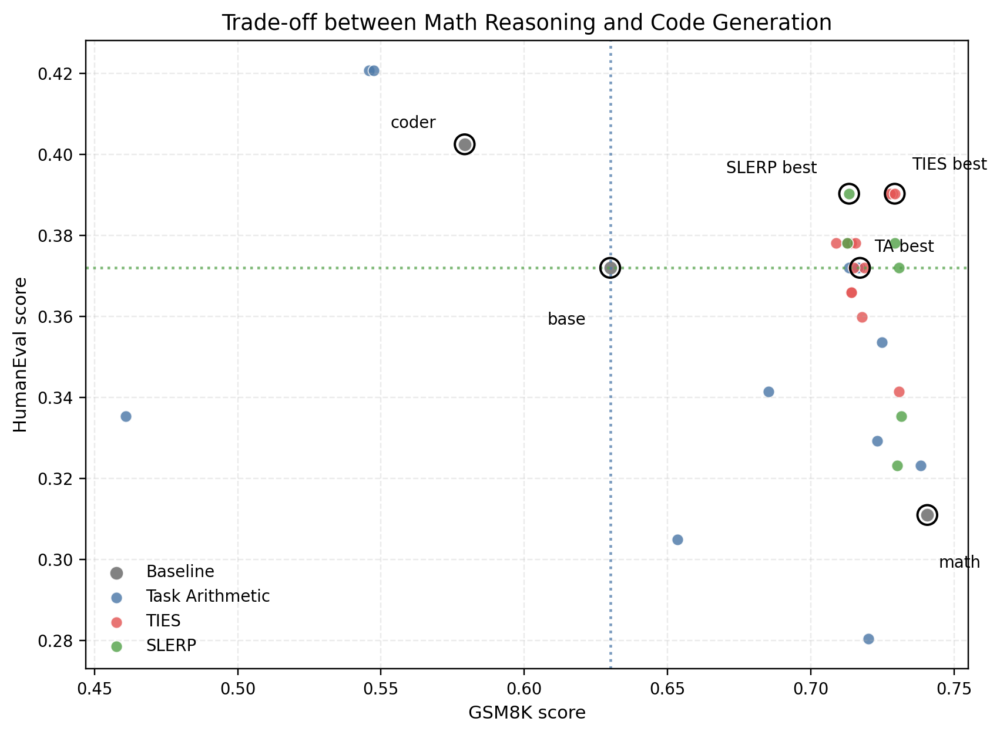

# Qwen2.5-1.5B 专家模型合并

这是一个面向数学推理与代码生成的模型合并实验项目。项目研究 Qwen2.5-1.5B 的 `base`、`math` 和 `coder` checkpoint，在模型配置存在差异的情况下，如何通过 MLP 子空间的局部合并，构造一个更均衡的数学与代码模型。

## 项目亮点

- **结构感知的合并策略**：发现 `base`、`math`、`coder` 的上下文配置并不完全一致，因此避免高风险的全参数合并，优先在 MLP 子空间中实验。
- **系统比较三种方法**：统一比较 Task Arithmetic、TIES 和层选择式 SLERP。
- **定位有效迁移区域**：通过层消融和参数扫描发现 MLP `9-18` 层是代码能力注入的关键范围。
- **结果可解释**：以 GSM8K 和 HumanEval 作为核心目标，以 MMLU 观察通用能力损失，明确展示能力迁移与取舍。

## 核心结果

当前实验的主要结论如下：

- **合并方向**：以 `math` 作为 `base_model`，向 `coder` 注入 MLP 子空间能力。
- **关键层范围**：MLP `9-18` 层最关键。
- **最佳代表配置**：`ties_math_plus_coder_mlp_layers_9_18_lam_0p05_dens_0p85`。
- **核心目标**：重点关注 GSM8K 与 HumanEval；MMLU 作为通用能力稳定性参考。
- **主指标口径**：
  - GSM8K：`exact_match, flexible-extract`
  - MMLU：`acc, none`
  - HumanEval：`pass@1, create_test`

最佳配置为：

```text
math + coder / MLP layers 9-18
method=TIES, lambda=0.05, density=0.85
```

| 模型/配置 | GSM8K | MMLU | HumanEval | core_score | score_3task |
|---|---:|---:|---:|---:|---:|
| `base` | 0.6300 | 0.6095 | 0.3720 | 2.0000 | 3.0000 |
| `math` | 0.7407 | 0.4375 | 0.3110 | 2.0118 | 2.7296 |
| `coder` | 0.5792 | 0.5374 | 0.4024 | 2.0013 | 2.8830 |
| Task Arithmetic | 0.7172 | 0.4300 | 0.3720 | 2.1384 | 2.8438 |
| **TIES（最佳代表）** | **0.7293** | 0.4310 | **0.3902** | **2.2068** | **2.9139** |
| SLERP | 0.7134 | 0.4309 | 0.3902 | 2.1816 | 2.8885 |

最佳模型不是全面超过 `base` 的模型，而是以 `math` 为主体、注入 `coder` MLP 能力的折中模型。相对 `math`，GSM8K 基本保持，同时 HumanEval 从 `0.3110` 提升到 `0.3902`；MMLU 仍明显低于 `base`。



更多图表见 [outputs/figures/](outputs/figures/)，完整实验分析见 [outputs/merge_experiment_report.md](outputs/merge_experiment_report.md)，精简结果表见 [outputs/merge_results_summary.csv](outputs/merge_results_summary.csv)。

HumanEval 只有 164 个样本，且代码执行指标在不同平台上的支持情况可能不同，因此小幅差异不应过度解读。报告中的结论主要关注明显的能力变化和整体趋势。

## 2. 环境配置

环境配置说明见 [ENVIRONMENT_SETUP.md](ENVIRONMENT_SETUP.md)。

建议使用两个 Conda 环境：

- `merge`：运行 `mergekit` 与模型合并脚本。
- `model_merge`：运行 `lm-eval` 与模型测评脚本。

## 3. 仓库结构

当前提交版仓库只保留复现实验所需的代码、配置、CSV 结果和报告。

```text
.
├── README.md
├── ENVIRONMENT_SETUP.md
├── PROJECT_ROADMAP.md
├── PROJECT_SUMMARY.md
├── configs/
│   └── paths.example.yml
├── scripts/
│   ├── run_best_merge.py
│   ├── run_best_eval.py
│   ├── reproduce_best.py
│   ├── plot_results.py
│   ├── check_results.py
│   └── check_project.py
├── eval/
│   ├── evaluate_models.py
│   ├── normalized_score.py
│   ├── check_mergeability.py
│   ├── compare_model_params.py
│   └── compare_base_pairs.py
├── eval_results/
│   └── *.csv
├── merge/
│   ├── single_expert_merge.py
│   ├── slerp_experiment.py
│   └── experiments/
│       └── *.yml
└── outputs/
    ├── merge_experiment_report.md
    └── merge_results_summary.csv
```

说明：

- `models/` 不随仓库提交，复现实验时需在本地准备原始模型。
- `merge_outputs/` 不随仓库提交，合并模型可由脚本重新生成。
- `eval_results/` 仅保留报告引用的 CSV 结果，`.json` 和 `.log` 已清理。

## 4. 文件职责

| 路径 | 作用 |
|---|---|
| `merge/single_expert_merge.py` | Task Arithmetic 与 TIES 的主合并脚本，支持层选择、排除层、分层权重和 density 扫描。 |
| `merge/slerp_experiment.py` | 层选择式 SLERP 合并脚本。 |
| `merge/experiments/` | 与报告结果对应的 mergekit YAML 配置。 |
| `eval/evaluate_models.py` | 统一测评脚本，调用 `lm-eval` 运行 GSM8K、MMLU、HumanEval。 |
| `eval/normalized_score.py` | 根据 `base` 分数计算 `core_score` 和 `score_3task`。 |
| `eval/check_mergeability.py` | 检查模型结构、配置和参数形状是否适合合并。 |
| `eval/compare_model_params.py` | 比较两个模型之间的参数差异。 |
| `eval/compare_base_pairs.py` | 比较 `base`、`math`、`coder` 之间的参数差异。 |
| `eval_results/` | 保存最终报告引用的 CSV 测评结果。 |
| `outputs/merge_experiment_report.md` | 最终实验报告。 |
| `outputs/merge_results_summary.csv` | 精简结果汇总表。 |

## 5. 复现主实验

运行前进入项目根目录：

```bash
cd ~/Qwen_merge
```

### 5.1 TIES 主结果

合并模型：

```bash
conda activate merge
python merge/single_expert_merge.py \
  --method ties \
  --base-name math \
  --expert coder \
  --preset mlp \
  --layers 9-18 \
  --lambda 0.05 \
  --density 0.85
```

测评模型：

```bash
conda activate model_merge
python eval/evaluate_models.py \
  --scan \
  --models-dir merge_outputs \
  --models ties_math_plus_coder_mlp_layers_9_18_lam_0p05_dens_0p85 \
  --tasks gsm8k mmlu humaneval \
  --output eval_results/ties_math_plus_coder_mlp_layers_9_18_lam_0p05_dens_0p85-all.json 
```

### 5.2 Task Arithmetic 代表结果

合并模型：

```bash
conda activate merge
python merge/single_expert_merge.py \
  --method task_arithmetic \
  --base-name math \
  --expert coder \
  --preset mlp \
  --exclude-layers 0-8 \
  --lambda 0.05
```

测评模型：

```bash
conda activate model_merge
python eval/evaluate_models.py \
  --scan \
  --models-dir merge_outputs \
  --models ta_math_plus_coder_mlp_exclude_layers_0_8_lam_0p05 \
  --tasks gsm8k mmlu humaneval \
  --output eval_results/ta_math_plus_coder_mlp_exclude_layers_0_8_lam_0p05-all.json 
```

### 5.3 SLERP 代表结果

合并模型：

```bash
conda activate merge
python merge/slerp_experiment.py \
  --start math \
  --end coder \
  --layers 9-18 \
  --t 0.125
```

测评模型：

```bash
conda activate model_merge
python eval/evaluate_models.py \
  --scan \
  --models-dir merge_outputs \
  --models slerp_math_to_coder_mlp_layers_9_18_t_0p125 \
  --tasks gsm8k mmlu humaneval \
  --output eval_results/slerp_math_to_coder_mlp_layers_9_18_t_0p125-all.json 
```

## 6. 结果汇总

测评完成后可运行：

```bash
conda activate model_merge
python eval/normalized_score.py --results-dir eval_results
```

也可以保存归一化结果：

```bash
python eval/normalized_score.py --results-dir eval_results --output outputs/normalized_results.csv
```

从汇总 CSV 重建图表：

```bash
python scripts/plot_results.py
```

运行不需要模型权重的项目检查：

```bash
python scripts/check_project.py
python scripts/check_results.py
```

有本地模型权重后，可以对比代表模型的实际生成：

```bash
python scripts/infer_compare.py \
  --model base=models/Qwen2.5-1.5B-base \
  --model math=models/Qwen2.5-1.5B-math \
  --model merged=merge_outputs/ties_math_plus_coder_mlp_layers_9_18_lam_0p05_dens_0p85 \
  --output outputs/inference_comparison.md
```

重复测评入口：

```bash
python scripts/repeat_stability.py --config configs/paths.yml --seeds 42 43 44 --offline
```

PDF 导出需要本机安装 Pandoc 和 LaTeX：

```bash
python scripts/export_report_pdf.py
```

归一化分数定义：

```text
core_score = GSM8K / base_GSM8K + HumanEval / base_HumanEval
score_3task = core_score + MMLU / base_MMLU
```

其中 `base` 的 `core_score = 2.0000`，`score_3task = 3.0000`。

## 7. 不随仓库提交的内容

以下内容已清理或由 `.gitignore` 忽略：

- `models/`：原始模型权重，需本地准备。
- `merge_outputs/`：合并模型输出，可由脚本重新生成。
- `eval_results/*.json`、`eval_results/*.log`：测评原始 JSON 与日志，可重新生成。
- `__pycache__/`、`.tmp_recipes/`、`.vscode/`：缓存或本地临时文件。

## 项目升级路线

后续工程化任务和完成状态见 [PROJECT_ROADMAP.md](PROJECT_ROADMAP.md)。

