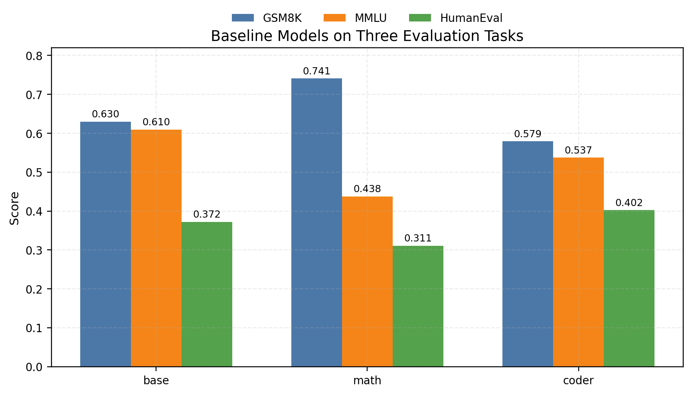
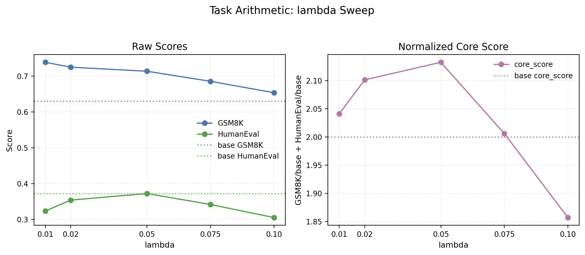
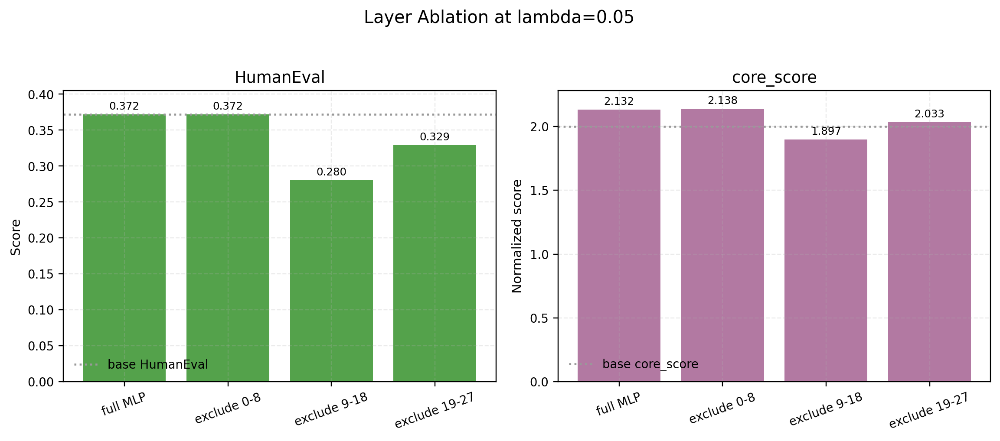
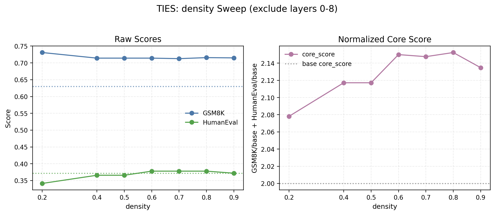
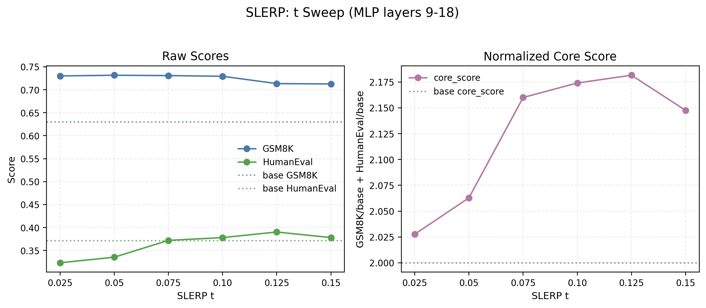

# Qwen2.5-1.5B 系列模型合并实验报告

### 241880351 劳煜杰

## 1. 摘要

本实验围绕 Qwen2.5-1.5B 系列的三个专家模型展开：

- `base`：Qwen2.5-1.5B-base
- `math`：Qwen2.5-1.5B-math
- `coder`：Qwen2.5-1.5B-coder

由于 `base`、`math`、`coder` 的配置存在部分差异，主要表现为 `rope_theta`、`max_position_embeddings`、`sliding_window`、`max_window_layers` 等上下文和位置编码相关参数不一致，本实验没有进行全参数合并，而是集中在较安全保守的 `mlp` 子空间上。并且为了合并策略和参数设置的合理性，实验报告中会展示整个实验的设计和实践过程。

本实验的核心目标不是单纯让模型在所有任务上超过 `base`，而是验证合并后模型能否在数学能力与代码能力之间取得更好的折中。实验中重点关注：

- GSM8K：数学推理能力
- HumanEval：代码生成能力
- MMLU：通用能力稳定性参考，不作为主要优化目标

最终实验表明，`math` 作为基座、向 `coder` 的 MLP 子空间迁移是当前最有效方向。


## 2. 实验背景与问题

最初的目标是直接将 `math` 与 `coder` 两个专家模型的能力合并到一个模型中，使其同时具备较好的数学推理能力和代码生成能力。

但三个模型虽然同属 Qwen2.5-1.5B 系列，配置并不完全一致：

| 配置项 | base | math | coder |
|---|---:|---:|---:|
| `max_position_embeddings` | 131072 | 4096 | 32768 |
| `rope_theta` | 1000000.0 | 10000 | 1000000.0 |
| `sliding_window` | 131072 | 4096 | 32768 |
| `max_window_layers` | 28 | 21 | 28 |
| `transformers_version` | 4.40.1 | 4.44.0 | 4.43.1 |

这些差异说明直接进行全层、全权重合并风险较高。尤其是注意力层与位置编码机制相关联，盲目合并可能造成模型行为不稳定。实验初期尝试过全层合并，但是不管哪种参数配置，合并模型效果都非常差。因此，本阶段实验将合并范围限制在 MLP 层：

```text
filter: "mlp."
```

这个选择牺牲了一部分可探索空间，但显著降低了结构不兼容带来的风险。

## 3. 实验环境与方法

### 3.1 环境

本地 Ubuntu/WSL 环境中使用两个 Conda 环境：

- `merge`：用于运行 `mergekit` 与合并脚本，主要负责生成 `merge_outputs/` 中的合并模型。
- `model_merge`：用于运行 `lm-eval` 与测评脚本，主要负责生成 `eval_results/` 中的 JSON、CSV 与日志文件。

两个环境的详细配置见仓库根目录的 `ENVIRONMENT_SETUP.md`。将合并与测评拆开可以减少依赖冲突，也方便分别排查 mergekit、lm-eval、CUDA 显存和 Hugging Face 缓存问题。

### 3.2 文件结构与作用

经过整理后，最终提交仓库只保留复现实验所需的代码、配置、CSV 结果和报告。当前主要文件作用如下：

| 路径 | 作用 |
|---|---|
| `README.md` | 仓库入口说明，概述实验目标、主结论、目录结构和主要复现命令。 |
| `ENVIRONMENT_SETUP.md` | 环境配置说明，给出 `merge` 与 `model_merge` 两个 Conda 环境的依赖安装和常见问题。 |
| `.gitignore` | 忽略本地模型权重、合并输出、缓存文件和可再生成日志。 |
| `merge/single_expert_merge.py` | Task Arithmetic 与 TIES 的主合并脚本，支持 `--layers`、`--exclude-layers`、`--layer-weight`、`--density/--densities` 等参数。 |
| `merge/slerp_experiment.py` | 层选择式 SLERP 实验脚本，用于 `math -> coder` 的 MLP 9-18 层插值实验。 |
| `merge/experiments/` | 与报告结果对应的 mergekit YAML 配置文件，便于复现已报告的 TA、TIES、SLERP 实验。 |
| `eval/evaluate_models.py` | 统一测评入口，负责调用 `lm-eval` 跑 GSM8K、MMLU、HumanEval，并把结果展开成 CSV。 |
| `eval/normalized_score.py` | 从 `eval_results/` 中读取结果，按照 `base` 分数计算归一化总分。 |
| `eval/check_mergeability.py` | 检查模型参数、配置和张量形状是否适合合并。 |
| `eval/compare_model_params.py`、`eval/compare_base_pairs.py` | 比较模型权重差异，用于分析合并前后或专家模型之间的参数变化。 |
| `eval_results/` | 保留最终报告引用的 CSV 测评结果；`.json` 和 `.log` 已清理。 |
| `outputs/merge_results_summary.csv` | 当前实验结果的精简汇总表。 |
| `outputs/merge_experiment_report.md` | 本实验报告。 |

原始模型权重目录 `models/` 和合并模型输出目录 `merge_outputs/` 不随仓库提交；复现实验时需按照 `ENVIRONMENT_SETUP.md` 在本地准备原始模型，并由合并脚本重新生成 `merge_outputs/`。

### 3.3 合并工具与输出格式

主要使用 `mergekit-yaml` 进行模型合并。当前脚本生成的合并配置遵循：

- 计算精度：`dtype: float32`
- 输出精度：`out_dtype: float16`
- tokenizer 来源：`tokenizer_source: base`，这里的 `base` 是 mergekit 配置中的 `base_model`，不是固定指 Qwen 原始 `base` 模型；例如 `math + coder/mlp` 实验中 `base_model` 是 `math`，因此 tokenizer 实际来自 `math`。
- 主要合并范围：MLP 层
- 默认输出格式：`safe-serialization`
- 默认复制 tokenizer：`--copy-tokenizer`

Task Arithmetic 与 TIES 主要通过 `merge/single_expert_merge.py` 生成 YAML 并调用 `mergekit-yaml`。SLERP 主要通过 `merge/slerp_experiment.py` 生成层选择式 YAML 并调用 `mergekit-yaml`。

### 3.4 评测任务、设置与指标

测评统一由 `eval/evaluate_models.py` 调用 `lm-eval` 完成，所有模型使用相同 few-shot、生成长度和解码设置，以保证结果可比。

| 任务 | few-shot | 生成上限 | 主指标 | 样本量 | 任务含义 |
|---|---:|---:|---|---:|---|
| GSM8K | 5 | 256 | `exact_match, flexible-extract` | 1319 | 小学数学应用题，衡量数学推理和最终答案抽取能力。 |
| MMLU | 5 | 256 | `acc, none` | 14042 | 多学科选择题，作为通用知识和稳定性参考。 |
| HumanEval | 0 | 256 | `pass@1, create_test` | 164 | Python 函数生成任务，衡量代码生成能力。 |

评测使用确定性生成设置：

- `do_sample=False`
- `temperature=0.0`
- `top_p=1.0`
- `batch_size=1`
- `seed=42`

需要说明的是，GSM8K 结果文件中同时包含 `strict-match` 与 `flexible-extract` 两个 exact match 指标。本报告统一采用 `exact_match, flexible-extract` 作为 GSM8K 主指标，因为它更符合数学题从模型长输出中抽取最终答案的评测方式。MMLU 统一采用 `acc, none`；HumanEval 统一采用 `pass@1, create_test`。各任务对应的 `*_stderr` 列是标准误，用于衡量统计不确定性，不作为主性能分数。

### 3.5 归一化评价指标

为了更直观比较合并模型相对 `base` 的表现，使用两个归一化分数：

```text
core_score = GSM8K / base_GSM8K + HumanEval / base_HumanEval
score_3task = core_score + MMLU / base_MMLU
```

其中：

- `core_score` 更符合当前实验目标，因为重点是 GSM8K 与 HumanEval。
- `score_3task` 保留 MMLU 作为稳定性参考，但 MMLU 下降会显著拉低该分数。

`base` 的两个分数分别为：

```text
core_score = 2.0000
score_3task = 3.0000
```

## 4. 基线模型表现

| 模型 | GSM8K | MMLU | HumanEval | core_score | score_3task | 观察 |
|---|---:|---:|---:|---:|---:|---|
| base | 0.6300 | 0.6095 | 0.3720 | 2.0000 | 3.0000 | 通用能力最强，MMLU 明显最高 |
| math | 0.7407 | 0.4375 | 0.3110 | 2.0118 | 2.7296 | 数学最强，但代码较弱 |
| coder | 0.5792 | 0.5374 | 0.4024 | 2.0013 | 2.8830 | 代码最强，但数学弱于 base 与 math |



图 1 展示了三个基线模型在三项任务上的互补关系：`math` 在 GSM8K 上最强，`coder` 在 HumanEval 上最强，而 `base` 在 MMLU 上明显更强。


基线结果清楚呈现了三者能力分布：

- `math` 在 GSM8K 上最强。
- `coder` 在 HumanEval 上最强。
- `base` 在 MMLU 上明显最强。


## 5. 实验过程

### 5.1 初步实验

早期尝试思路是：以 `base` 为基准，提取 `coder` 和 `math` 在 `MLP` 层上的任务向量，按一定系数比例融合，归一化后乘以系数 λ，再加回 `base`；非 `MLP` 层完全保持 `base` 不变。

但是结果表明这样的合并模型在三种测评上的效果都非常差，模型甚至不能回答一些非常简单的问题，例如输出一段a+b功能的python代码。仅仅在 λ 非常小（小于0.05）时，合并模型能够有接近 `base` 模型的表现，但我们也有理由怀疑这是因为参数变化太过微小导致的。

对于这个合并策略的失败，我的猜想是：实验所用的三个模型并不满足上述方法的核心假设：`coder/math` 相对于 `base` 的 `MLP` 差分是线性可加、能独立迁移的。这三个专家模型的专家能力通常是跨层协同形成的，即 `MLP` 层与 `attention/norm` 层等共同工作，`MLP` 层与非 `MLP` 层之间有一定的“适应性”。如果只把专家模型相对 `base` 的 MLP 差分加回 `base`，可能会破坏这种跨模块适配关系，导致模型行为不稳定。

### 5.2 Task Arithmetic 方向与 λ 扫描

进一步，我们基于 Task Arithmetic 方法与初步实验经验，尝试了两个可能的方向：

```text
math + coder/mlp 即 θ_merge,mlp = θ_math,mlp + λ·(θ_coder,mlp - θ_math,mlp)
```
```text
coder + math/mlp 即 θ_merge,mlp = θ_coder,mlp + λ·(θ_math,mlp - θ_coder,mlp)
```
即分别以 `math` 和 `coder` 为基准，提取另一个模型在 `MLP` 层上的任务向量，再与基准模型参数合并。

对于两种方向，我们分别扫描了一系列 λ 的合并模型表现。而实验结果表明，前者的效果优于后者。

主要实验结果：

| 配置 | GSM8K | MMLU | HumanEval | core_score | score_3task |
|---|---:|---:|---:|---:|---:|
| `ta_math_plus_coder_mlp_lam_0p01` | 0.7384 | 0.4365 | 0.3232 | 2.0409 | 2.7571 |
| `ta_math_plus_coder_mlp_lam_0p02` | 0.7248 | 0.4360 | 0.3537 | 2.1012 | 2.8165 |
| `ta_math_plus_coder_mlp_lam_0p05` | 0.7134 | 0.4327 | 0.3720 | 2.1324 | 2.8423 |
| `ta_math_plus_coder_mlp_lam_0p075` | 0.6854 | 0.4279 | 0.3415 | 2.0059 | 2.7078 |
| `ta_math_plus_coder_mlp_lam_0p1` | 0.6535 | 0.4175 | 0.3049 | 1.8570 | 2.5419 |
| `ta_coder_plus_math_mlp_lam_0p01` | 0.5459 | 0.5343 | 0.4207 | 1.9976 | 2.8741 |
| `ta_coder_plus_math_mlp_lam_0p02` | 0.5474 | 0.5310 | 0.4207 | 2.0000 | 2.8712 |
| `ta_coder_plus_math_mlp_lam_0p05` | 0.4610 | 0.5028 | 0.3354 | 1.6333 | 2.4582 |



图 2 展示了 `math + coder/mlp` 方向的 λ 扫描结果：当 λ 增大到 `0.05` 时，HumanEval 明显提升；继续增大 λ 后，GSM8K 与 `core_score` 开始下降。


结论：

- `math + coder/mlp` 在较小 λ 下可以保留 GSM8K，同时提升 HumanEval。
- λ 从 `0.01` 到 `0.05` 时，HumanEval 提升明显。
- λ 继续增大到 `0.075`、`0.1` 后，GSM8K 和整体表现下降。
- `λ=0.05` 成为 Task Arithmetic 阶段较稳的折中点。

注意到合并模型随 λ 变化的性能变化情况，我们将 `0.05` 作为当前较稳的折中 λ，并在此基础上做了分层消融和分层权重的尝试。

### 5.3 分层消融与分层权重

a. 在 `math + coder/mlp, λ=0.05` 基础上做分层消融：

- 缺少 0-8 层
- 缺少 9-18 层
- 缺少 19-27 层
  
缺少某一段意味着该范围内的 λ = 0，合并模型在这些层的 MLP 权重完全等于 `math` 的权重。

实验结果：

| 配置 | GSM8K | MMLU | HumanEval | core_score | score_3task |
|---|---:|---:|---:|---:|---:|
| `ta_math_plus_coder_mlp_exclude_layers_0_8_lam_0p05` | 0.7172 | 0.4300 | 0.3720 | 2.1384 | 2.8438 |
| `ta_math_plus_coder_mlp_exclude_layers_9_18_lam_0p05` | 0.7202 | 0.4375 | 0.2805 | 1.8973 | 2.6151 |
| `ta_math_plus_coder_mlp_exclude_layers_19_27_lam_0p05` | 0.7233 | 0.4323 | 0.3293 | 2.0333 | 2.7425 |



图 3 比较了完整 MLP 合并与三组分层消融结果：去掉 9-18 层时，HumanEval 与 `core_score` 下降最明显，说明中间层是后续层选择实验的关键范围。


结论：

- 任意去掉一个大段都没有带来稳定提升，反而可能会导致性能下降。
- 去掉 9-18 层时 HumanEval 明显下降到 `0.2805`，说明中间层对代码能力注入尤其重要。
- 去掉 0-8 层对性能影响较小，因此后续优先考虑弱化或排除 0-8 层。

b. 在 `math + coder/mlp, exclude 0-8 layers` 基础上做分层权重：

实验结果：

| 配置 | GSM8K | MMLU | HumanEval | core_score | score_3task |
|---|---:|---:|---:|---:|---:|
| `ta_math_plus_coder_mlp_exclude_layers_0_8_lam_0p05` | 0.7172 | 0.4300 | 0.3720 | 2.1384 | 2.8438 |
| `ta_math_plus_coder_mlp_weight_0_8_0p0_9_27_1p1_lam_0p05` | 0.7172 | 0.4300 | 0.3720 | 2.1384 | 2.8438 |
| `ta_math_plus_coder_mlp_weight_0_8_0p0_9_27_1p2_lam_0p05` | 0.7165 | 0.4303 | 0.3720 | 2.1372 | 2.8431 |

分层权重对结果的影响并不大，因此我们将 `math + coder/mlp, exclude 0-8 layers, λ=0.05` 作为 Task Arithmetic 的代表配置。

### 5.4 TIES

TIES 实验最初在：

```text
math + coder/mlp, exclude_layers_0_8, λ=0.05
```

上扫 density，实验结果为：

| 配置 | GSM8K | MMLU | HumanEval | core_score | score_3task |
|---|---:|---:|---:|---:|---:|
| `ties_math_plus_coder_mlp_exclude_layers_0_8_lam_0p05_dens_0p2` | 0.7309 | 0.4374 | 0.3415 | 2.0781 | 2.7957 |
| `ties_math_plus_coder_mlp_exclude_layers_0_8_lam_0p05_dens_0p4` | 0.7142 | 0.4338 | 0.3659 | 2.1172 | 2.8288 |
| `ties_math_plus_coder_mlp_exclude_layers_0_8_lam_0p05_dens_0p5` | 0.7142 | 0.4312 | 0.3659 | 2.1172 | 2.8246 |
| `ties_math_plus_coder_mlp_exclude_layers_0_8_lam_0p05_dens_0p6` | 0.7142 | 0.4311 | 0.3780 | 2.1500 | 2.8573 |
| `ties_math_plus_coder_mlp_exclude_layers_0_8_lam_0p05_dens_0p7` | 0.7127 | 0.4304 | 0.3780 | 2.1476 | 2.8537 |
| `ties_math_plus_coder_mlp_exclude_layers_0_8_lam_0p05_dens_0p8` | 0.7157 | 0.4297 | 0.3780 | 2.1524 | 2.8574 |
| `ties_math_plus_coder_mlp_exclude_layers_0_8_lam_0p05_dens_0p9` | 0.7149 | 0.4305 | 0.3720 | 2.1348 | 2.8411 |



图 4 展示了 `exclude_layers_0_8, λ=0.05` 设置下的 TIES density 扫描结果：`density=0.6~0.8` 在 HumanEval 与 `core_score` 上形成较好折中，因此后续以 `density=0.8` 作为进一步搜索点。


从而将 `dens = 0.8` 作为后续小范围搜索的初步折中配置。

之后进一步扫描了 `λ = 0.045, 0.055` 的两种情况，实验结果为：

| 配置 | GSM8K | MMLU | HumanEval | core_score | score_3task |
|---|---:|---:|---:|---:|---:|
| `ties_math_plus_coder_mlp_exclude_layers_0_8_lam_0p045_dens_0p8` | 0.7187 | 0.4307 | 0.3720 | 2.1408 | 2.8474 |
| `ties_math_plus_coder_mlp_exclude_layers_0_8_lam_0p05_dens_0p8` | 0.7157 | 0.4297 | 0.3780 | 2.1524 | 2.8574 |
| `ties_math_plus_coder_mlp_exclude_layers_0_8_lam_0p055_dens_0p8` | 0.7089 | 0.4294 | 0.3780 | 2.1415 | 2.8459 |

综合 GSM8K 与 HumanEval 后，保留 `dens = 0.8, λ=0.05` 作为后续层选择实验的折中配置。

进一步，由于在 TA 的分层消融实验中我们发现 9 - 18 层对合并模型性能有很大影响，于是我们继续做一次分层实验，实验结果为：

| 配置 | GSM8K | MMLU | HumanEval | core_score | score_3task |
|---|---:|---:|---:|---:|---:|
| `ties_math_plus_coder_mlp_layers_9_18_lam_0p05_dens_0p8` | 0.7278 | 0.4313 | 0.3902 | 2.2044 | 2.9121 |
| `ties_math_plus_coder_mlp_layers_19_27_lam_0p05_dens_0p8` | 0.7180 | 0.4341 | 0.3598 | 2.1068 | 2.8190 |

相比只保留 19-27 层，只保留 9-18 层在 GSM8K 与 HumanEval 上更好，因此继续围绕 9-18 层轻扫 density：

| 配置 | GSM8K | MMLU | HumanEval | core_score | score_3task |
|---|---:|---:|---:|---:|---:|
| `ties_math_plus_coder_mlp_layers_9_18_lam_0p05_dens_0p75` | 0.7286 | 0.4318 | 0.3902 | 2.2056 | 2.9141 |
| `ties_math_plus_coder_mlp_layers_9_18_lam_0p05_dens_0p8` | 0.7278 | 0.4313 | 0.3902 | 2.2044 | 2.9121 |
| `ties_math_plus_coder_mlp_layers_9_18_lam_0p05_dens_0p85` | 0.7293 | 0.4310 | 0.3902 | 2.2068 | 2.9139 |

三组结果非常接近，说明 `density = 0.75~0.85` 形成了一个稳定平台。

如果只看核心目标 GSM8K + HumanEval，则 `density = 0.85` 略优；如果把 MMLU 也等权纳入，则 `density = 0.75` 略优。但这两个差异都很小，不应过度解读。所以更稳妥的结论是：`math + coder/mlp, 9-18 layers, λ = 0.05, dens = 0.75~0.85` 构成了一个稳定有效区间。

### 5.5 SLERP

基于前面实验经验，SLERP 使用：

```text
math -> coder, mlp layers 9-18
```

并扫描 `t = 0.025~0.15`。

实验结果：

| 配置 | GSM8K | MMLU | HumanEval | core_score | score_3task |
|---|---:|---:|---:|---:|---:|
| `slerp_math_to_coder_mlp_layers_9_18_t_0p025` | 0.7301 | 0.4372 | 0.3232 | 2.0277 | 2.7450 |
| `slerp_math_to_coder_mlp_layers_9_18_t_0p05` | 0.7316 | 0.4346 | 0.3354 | 2.0629 | 2.7759 |
| `slerp_math_to_coder_mlp_layers_9_18_t_0p075` | 0.7309 | 0.4344 | 0.3720 | 2.1600 | 2.8727 |
| `slerp_math_to_coder_mlp_layers_9_18_t_0p1` | 0.7293 | 0.4333 | 0.3780 | 2.1740 | 2.8850 |
| `slerp_math_to_coder_mlp_layers_9_18_t_0p125` | 0.7134 | 0.4309 | 0.3902 | 2.1816 | 2.8885 |
| `slerp_math_to_coder_mlp_layers_9_18_t_0p15` | 0.7127 | 0.4303 | 0.3780 | 2.1476 | 2.8535 |



图 5 展示了 MLP 9-18 层上的 SLERP `t` 扫描结果：较小的 `t` 更有利于保留 GSM8K，较大的 `t` 能提升 HumanEval，整体折中在 `t=0.10~0.125` 附近趋于稳定。

SLERP 的趋势与 TIES 类似：

- 小 `t` 更保守，GSM8K 保留更好。
- 较大 `t` 有利于 HumanEval，但会牺牲 GSM8K。

因此可以认为，`t = 0.075, 0.1, 0.125` 都是较好的 `slerp` 结果，但取舍不同：`t=0.075/0.1` 更偏向保留 GSM8K，`t=0.125` 的 HumanEval 最好，但数学能力损失更明显。

## 6. 方法间对比

| 方法 | 最佳代表配置（若有多个任取一个） | GSM8K | MMLU | HumanEval | core_score | score_3task |
|---|---|---:|---:|---:|---:|---:|
| Task Arithmetic | `ta_math_plus_coder_mlp_exclude_layers_0_8_lam_0p05` | 0.7172 | 0.4300 | 0.3720 | 2.1384 | 2.8438 |
| TIES | `ties_math_plus_coder_mlp_layers_9_18_lam_0p05_dens_0p85` | 0.7293 | 0.4310 | 0.3902 | 2.2068 | 2.9139 |
| SLERP | `slerp_math_to_coder_mlp_layers_9_18_t_0p125` | 0.7134 | 0.4309 | 0.3902 | 2.1816 | 2.8885 |


图 6 将所有保留实验绘制到 GSM8K-HumanEval 平面上：虚线表示 `base` 的对应分数，点越靠右说明数学能力越强，越靠上说明代码能力越强。


从当前数据看：

1. 三种方法最终都收敛到相近的平台。
2. TIES 数值上最好，但优势不大。
3. SLERP 的表现接近 TIES，说明方向选择和层选择比具体合并算法更重要。
4. Task Arithmetic 较简单，但在最佳点上略弱于 TIES 与 SLERP。

整体来看，实验收益主要来自合并方向与层选择，而不是某一个具体合并算法本身；TIES 数值最好，但 SLERP 的相近表现说明 `math → coder` 的 MLP 9-18 子空间本身就是有效迁移方向。

## 7. 最佳模型分析

当前最优模型：

```text
ties_math_plus_coder_mlp_layers_9_18_lam_0p05_dens_0p85
```

与三个基线相比：

| 对比对象 | GSM8K 变化 | MMLU 变化 | HumanEval 变化 | 解释 |
|---|---:|---:|---:|---|
| 相对 base | +0.0993 | -0.1785 | +0.0183 | 数学与代码核心目标提升，但通用能力下降 |
| 相对 math | -0.0114 | -0.0066 | +0.0793 | 基本保留数学能力，明显补强代码 |
| 相对 coder | +0.1501 | -0.1064 | -0.0122 | 数学大幅强于 coder，代码略低于 coder |

这个结果的意义在于：

- 它不是一个“全面超过 base”的模型。
- 它是一个以 `math` 为主体、注入了部分 `coder` MLP 能力的双任务折中模型。
- 在核心目标上，它比 `base` 更适合数学 + 代码联合场景。

## 8. 统计与可靠性说明

需要注意 HumanEval 的样本量只有 164，标准误约为 `0.038`。因此：

- `0.3780`、`0.3902`、`0.4024` 之间的差异不宜过度解释。
- HumanEval 上“略高”或“略低”需要谨慎表述。
- 但 `math` 的 HumanEval `0.3110` 到 TIES 最优模型 `0.3902` 的提升幅度较大，具有更明确的实验意义。

GSM8K 样本量为 1319，标准误约为 `0.012`。因此：

- TIES 最优模型与 `base` 的 GSM8K 差距较明显。
- TIES 最优模型与 `math` 的 GSM8K 差距较小。
- TIES density `0.75`、`0.8`、`0.85` 之间的差异非常小，不应判断为严格排序。

MMLU 样本量较大，标准误约为 `0.004`。MMLU 下降是真实存在的，但根据当前实验目标，它更适合作为通用能力参考，而不是主优化目标。

## 9. 结论

本阶段实验可以得到以下结论：

1. 对 Qwen2.5-1.5B `math` 与 `coder` 进行全层合并风险较高，当前 MLP-only 策略是合理的保守方案。
2. 简单单专家注入并不稳定，说明专家差分不能直接视作可迁移能力增量。
3. `math` 作为 base、注入 `coder` 的 MLP，是当前最有效方向。
4. 中间层 `9-18` 对代码能力注入最关键。
5. TIES、SLERP、Task Arithmetic 的差异小于层选择与合并方向的差异。
6. 当前最推荐保留的主结果是 TIES `layers_9_18, λ=0.05, density=0.75~0.85`。

以 GSM8K + HumanEval 为核心目标，实验已经得到了有价值的正结果。  
但如果想要 GSM8K + MMLU + HumanEval 三项等权超过 `base`，当前模型尚未达到，因为 MMLU 受 `math` base 影响明显偏低。


## 10. 可复现实验命令

本节给出合并模型与模型测评的完整命令。运行合并命令前建议切换到 `merge` 环境；运行测评命令前建议切换到 `model_merge` 环境。


### 10.1 Task Arithmetic

合并模型：

```bash
conda activate merge
python merge/single_expert_merge.py \
  --method task_arithmetic \
  --base-name math \
  --expert coder \
  --preset mlp \
  --exclude-layers 0-8 \
  --lambda 0.05
```

测评模型：

```bash
conda activate model_merge
python eval/evaluate_models.py \
  --scan \
  --models-dir merge_outputs \
  --models ta_math_plus_coder_mlp_exclude_layers_0_8_lam_0p05 \
  --tasks gsm8k mmlu humaneval \
  --output eval_results/ta_math_plus_coder_mlp_exclude_layers_0_8_lam_0p05-all.json 
```

### 10.2 TIES

合并模型：

```bash
conda activate merge
python merge/single_expert_merge.py \
  --method ties \
  --base-name math \
  --expert coder \
  --preset mlp \
  --layers 9-18 \
  --lambda 0.05 \
  --densities 0.8
```

测评模型：

```bash
conda activate model_merge
python eval/evaluate_models.py \
  --scan \
  --models-dir merge_outputs \
  --models ties_math_plus_coder_mlp_layers_9_18_lam_0p05_dens_0p85 \
  --tasks gsm8k mmlu humaneval \
  --output eval_results/ties_math_plus_coder_mlp_layers_9_18_lam_0p05_dens_0p85-all.json 
```

### 10.3 SLERP

合并模型：

```bash
conda activate merge
python merge/slerp_experiment.py \
  --start math \
  --end coder \
  --layers 9-18 \
  --t-values 0.1
```

测评模型：

```bash
conda activate model_merge
python eval/evaluate_models.py \
  --scan \
  --models-dir merge_outputs \
  --models slerp_math_to_coder_mlp_layers_9_18_t_0p125 \
  --tasks gsm8k mmlu humaneval \
  --output eval_results/slerp_math_to_coder_mlp_layers_9_18_t_0p125-all.json 
```

### 10.4 基线模型测评

如果需要重新测评三个原始模型，可运行：

```bash
conda activate model_merge
python eval/evaluate_models.py \
  --models base math coder \
  --tasks gsm8k mmlu humaneval \
  --output eval_results/baselines-all.json 
```

### 10.5 归一化分数汇总

所有测评完成后，可运行：

```bash
conda activate model_merge
python eval/normalized_score.py --results-dir eval_results
```

本报告中的主指标口径为：

```text
GSM8K     = exact_match, flexible-extract
MMLU      = acc, none
HumanEval = pass@1, create_test
```
